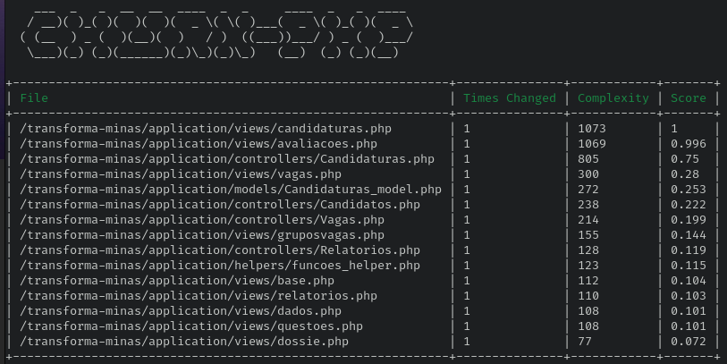

# Analise da qualidade com a ferramenta Churn PHP

Utilizaremos a ferramenta [churn-php](https://github.com/bmitch/churn-php) para coletar metas de 
complexidade ciclomatica. Diferente da ferramenta [PHP Insight](https://github.com/nunomaduro/phpinsights),
que coleta métricas gerais, a churn-php indica os arquivos com maior complexidade que podem se
beneficiar de práticas de refatoração. A ferramenta irá pontuar os arquivos de 0,1 a 1, sendo 0,1
complexidade mínima e 1 complexidade máxima.

Com a ferramenta instalada, executamos o seguinte comando:

    vendor/bin/churn run --configuration=tools/churn.yml application/models/ application/controllers/ application/views/ application/helpers/


Segundo dados coletados pela ferramenta, os 15 arquivos mais complexos do transforma são
apresentados na imagem abaixo:



Iremos avaliar alguns dos arquivos apontados pela ferramenta, discutindo possíveis motivos para
terem uma taxa alta de complexidade ciclomatica.

## views/candidaturas.php

O arquivo `views/candidaturas.php` possui 3882 linhas de código-fonte. Realizando uma contagem básica
do número de estruturas condicionais (if, else) no arquivo, temos 473 if e 58 else.  Um arquivo com
473 caminhos possíveis tem um custo enorme de manutenção e evolução, o que indica a alta taxa
de complexidade atribuida pela ferramenta. O Code Igniter segue o padrão MVC, e nele 
a camada de visualização **não pode implementar** regras de negócio. 
Alguns desses 473 caminhos possíveis são verificações que deveriam estar ou nas modelos ou nas
helpers. A seguir, um trecho de código que não deveria estar na view, e sim em uma helper para
candidaturas, por exemplo.

```
        if($menu2 == 'Curriculo'){
                /*$attributes = array('class' => 'kt-form kt-form--label-right',
                                            'id' => 'form_candidatura');*/
                /*if($num_formacao == 0 || $num_experiencia == 0){
                         "
                                                                             type=\"text/javascript\">
                                                                                    alert('Preencha a formação e experiência em dados pessoais para continuar.');
                                                                                    window.location='/';
                                                                            </script>
                    ";
                }*/
                if(strlen(set_value('num_formacao')) > 0){
                       
                        $num_formacao = set_value('num_formacao');
                }
                if(!($num_formacao>0)){
                        $num_formacao = 1;
                }
                if(strlen(set_value('num_experiencia')) > 0){
                        
                        $num_experiencia = set_value('num_experiencia');
                }
                if(!($num_experiencia>0)){
                        $num_experiencia = 1;
                }
                 form_open_multipart($url, $attributes, array('vaga' => $vaga, 'num_formacao' => $num_formacao, 'num_experiencia' => $num_experiencia));
        }
```


O fato desses caminhos e verificações estarem implementados diretamente na view, impede o reuso e a
implementação de testes para essas regras. Muitas dessas condicionais também são utilizadas para
controlar o estado da página. Além disso, o arquivo possui 21 linhas de código comentadas.

Por serem arquivos que geram as paginas html, views devem ser o mais desacopladas do backend
possível. Seguindo a própria documentação do [Code Igniter](https://codeigniter.com/userguide3/general/views.html), 
o construtor `echo` nas views deve ser utilizado apenas para apresentar variáveis que venham das controllers (carregamento dinamico), 
mas na plataforma o comando `echo` é utilizado para gerar toda a estrutura do html.
Isso polui o código, dificulta a manutenção e encarece a adição de novas funcionalidades e
comportamentos visuais. No arquivo
`views/candidaturas.php` o comando `echo` é utilizado 658 vezes.


```
echo "
            <section class=\"login-block\">
                <!-- Container-fluid starts -->
                <div class=\"container\">
                    <div class=\"row\">
                        <div class=\"col-sm-12 d-flex justify-content-center\">
                            <!-- Authentication card start -->";
$attributes = array('class' => 'md-float-material form-material');
echo form_open($url, $attributes);
echo "
                                    <div class=\"text-center\">
                                         config -> item('nome')."\" />
                                    </div>
                                    <!--<div class=\"row\" style=\"margin-top: 10px\">";
/*if($menu2 == 'index'){
        echo "
                                        <div class=\"alert background-danger\" style=\"width:90%;margin:0 auto;\">
                                               Prezado(a) candidato(a) dos editais de <strong>Processo Seletivo Simplificado Pró-Brumadinho</strong>, estes processos foram migrados para o sistema Processos Seletivos MG: <a href=\"http://www.processoseletivo.mg.gov.br/\"><strong>http://www.processoseletivo.mg.gov.br/</strong></a>
                                        </div>
                                        ";
}*/
echo "
                                    </div>-->
                                    <div class=\"card col-lg-8 mt-3 p-3 mx-auto\">
                                        <div class=\"card-block\">
                                            <div class=\"row m-b-20\">
                                                <div class=\"col-md-12\">
                                                    <h3 class=\"h3 text-gray-800 mb-4 text-center\">{$nome_pagina}</h3>
                                                </div>
                                            </div>";
```


Praticamente todos os pontos analisados na `views/candidaturas.php` se aplicam as outras views da
aplicação. **Não há testes automatizados para as views da aplicação**.

## controllers/Candidaturas.php

O arquivo `controllers/Candidaturas.php` possui  4215 linhas de código-fonte. Realizando uma contagem básica
do número de estruturas condicionais (if, else) no arquivo, temos 563 if e 257 else. Como essa
controller possui muitos métodos iremos analisar apenas um deles, apontando possíveis problemas no
estilo e no design do código. Vamos começar analisando o que é uma controller no padrão
MVC. O padrão MVC trabalha com separação de responsabilidades. A camada de visualização desenha a
tela e apresenta as regras de negócio estabelecidas e verificadas na camada modelo. A camada
modelo é quem armazena as regras de negócio da aplicação como, por exemplo, a nota que deve ser dada 
para uma resposta do candidato. A camada de controle é responsável por processar as requisições HTTP, 
controlar os objetos que vem da camada modelo e por inicializar a camada de apresentação.
Avaliando a implementação do método `calcula_nota`, na controller de candidaturas, é possível
notar que existe um problema de responsabilidade. A controller é responsável por mais do que ela
deveria, o que fere o princípio de responsabilidades do MVC.

```
    else if($questao -> in_tipo == '3' || $questao -> in_tipo == '4'){
            
            $total+=@intval($respostas[$questao -> pr_questao] -> tx_resposta) * intval($questao -> in_peso);
            $total_max += intval($questao -> in_peso);

    }
    else if($questao -> in_tipo == '5'){
            //$nota = 0;
            //0=>Nenhum,33%=>básico,66%=>intermediário,100%=>avançado
            $nota = round((@intval($respostas[$questao -> pr_questao] -> tx_resposta)/3)*intval($questao->in_peso));
            /*if(@intval($respostas[$questao -> pr_questao] -> tx_resposta)>=1 && ($questao -> vc_respostaAceita == '' || mb_convert_case($questao -> vc_respostaAceita, MB_CASE_LOWER, "UTF-8") == 'básico')){
                    $nota += intval($questao->in_peso);
            }
            else if(@intval($respostas[$questao -> pr_questao] -> tx_resposta)>=2 && mb_convert_case($questao -> vc_respostaAceita, MB_CASE_LOWER, "UTF-8") == 'intermediário'){
                    $nota += intval($questao->in_peso);
            }
            else if(@intval($respostas[$questao -> pr_questao] -> tx_resposta)>=3 && mb_convert_case($row -> vc_respostaAceita, MB_CASE_LOWER, "UTF-8") == 'avançado'){
                    $nota += intval($questao->in_peso);
            }
            $total_max += intval($questao->in_peso);*/
            $total+=$nota;
            $total_max += intval($questao->in_peso);
    }
    else if($questao -> in_tipo == '6'){
            
            $total+=@intval($respostas[$questao -> pr_questao] -> tx_resposta);
            $total_max += intval($questao -> in_peso);
    }
```

Neste trecho de código, notamos que é a controller `calcula_nota` a responsável por calcular a nota
dependendo da questão. Esse cálculo tem que estar implementado na modelo do
Candidato e testada de forma unitaria. O papel da controller é  receber o input do usuário,
instanciar a modelo que possui as regras de negócio, e **controlar** o processamento da requisição.
Esse trecho é um exemplo entre vários, que ferem o princípio de responsabilidade de uma controller
no padrão MVC.

Outro problema presente nas controllers é a duplicação de código. No método `calcula_nota`, a
mesma linha de código que recupera as questões do banco é chamada diversas vezes. Isso se dá pelo
alto número de caminhos condicionais que dificultam o reuso de código. 
**Não há testes automatizados para as controllers da aplicação**.

Praticamente todos os pontos analisados na `controllers/Candidaturas.php` se aplicam  as outras
controllers da aplicação.
