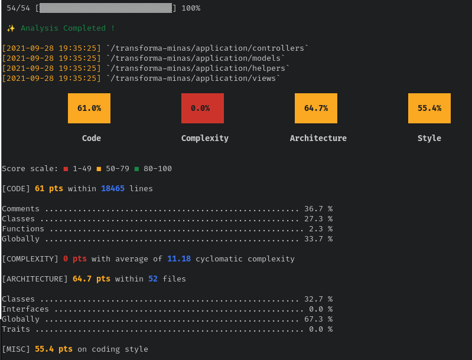
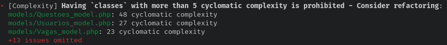
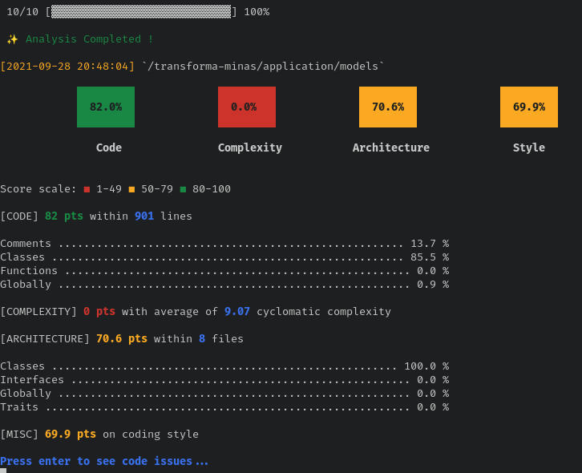
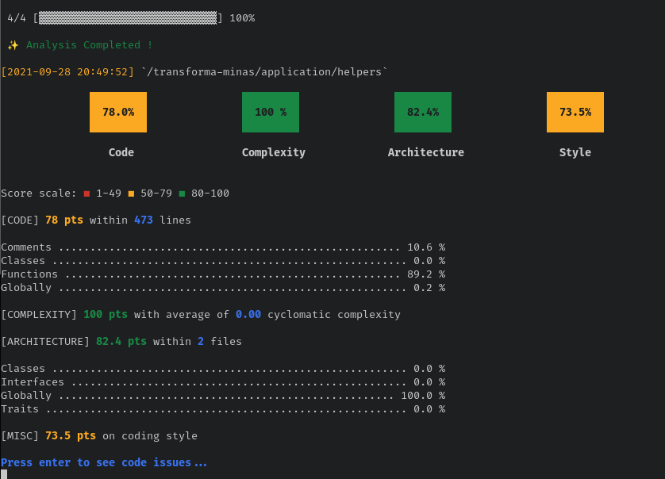
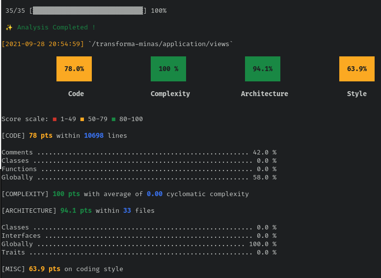

# Analise da qualidade com a ferramenta PHP Insight

Utilizaremos a ferramenta PHP Insight para coletar métricas e medidas relacionadas á qualidade do
código da plataforma. Iremos analisar a métrica de complexidade ciclomatica, mal cheiro de código, arquitetura e estilo de programação em PHP. Iremos focar em arquivos que pertencem ao
domínio da aplicação e excluiremos diretórios que pertençam ao Codeigniter ou a bibliotecas de
terceiros.

Iremos avaliar as métricas dos principais diretórios: `application/controllers`, `application/models/`,
`application/helpers/` e `application/views/`. São eles que de fato implementam o domínio da aplicação.
Faremos então uma análise __top-down__, ou seja, avaliaremos as métricas
de forma geral e depois avaliaremos os diretórios individualmente.  A ferramenta atribui uma 
pontuação de 0 a 100 para cada uma das métricas
(código, complexidade, arquitetura e estilo). Para cada métrica uma série de atributos são
analisados e são eles quem compõe a nota final dada pela ferramenta. Iremos interpretar os
percentuais que a ferramenta atribuiu para cada uma das métricas e tentar justificar, com exemplos
no código, as razões para cada percentual.

## Visão geral

Para coletar as métricas, executamos o seguinte comando:

    vendor/bin/phpinsights analyse application/controllers application/models/ application/helpers/ application/views/

e obtivemos o seguinte resultado:



Todos as métricas coletadas nessa etapa ficaram a baixo de 80, que é o valor considerado como bom
pela ferramenta.
Para a métrica de código foi atribuido **61** pontos (de 0 a 100). Nessa métrica, são
identificadas más práticas de programação em php como: 
variáveis sem uso, métodos sem retorno, estruturas de controle (if/else) mal utilizadas,
escopo de funções (public/private) incorretas entre outros.

A Complexidade média do transforma está em **0**, ou seja, o uso de estruturas condicionais ao longo
do código não poderia ser pior, segundo os dados coletados pela ferramenta. Um dos resultados
da ferramenta diz o seguinte:



Ou seja, existem classes no código do transforma com complexidade altissima, o que impacta
diretamente na manutenibilidade e estabilidade do código.

A arquitetura média está em 64 pontos. Aqui são analisados praticas como: tamanho das classes, número de
métodos por classe, gestão de dependencias, tamanho das funções entre outros. Também bem abaixo de
80. O estilo médio do código está em 55.4 pontos. O código apresenta má formatação e está fora do padrão
utilizado pela comunidade PHP.

Na visão geral do código, utilizando como insumo os resultados obtidos com a ferramenta, o
Transforma Minas apresenta uma série de pontos que precisam ser melhorados, principalmente no que
se refere à complexidade ciclomática. Agora iremos avaliar individualmente os principais diretórios
da aplicação.

## application/controllers

Para coletar as métricas, executamos o seguinte comando:

    vendor/bin/phpinsights analyse application/controllers/

e obtivemos o seguinte resultado:


## application/models

Para coletar as métricas, executamos o seguinte comando:

    vendor/bin/phpinsights analyse application/models/

e obtivemos o seguinte resultado:




## application/helpers

Para coletar as métricas, executamos o seguinte comando:

    vendor/bin/phpinsights analyse application/helpers/

e obtivemos o seguinte resultado:



## application/views

Para coletar as métricas, executamos o seguinte comando:

    vendor/bin/phpinsights analyse application/views/

e obtivemos o seguinte resultado:



As views de modo geral possuem pouco código php, o que explica o valor 100 para arquitetura e
complexidade. O maior problema desses arquivos é a estrutura do html que é gerada do lado do
servidor. A implementação abusa do uso da função `echo`, utilizando-a inclusive em diversos pontos
desnecessários. Um exemplo retirado do arquivo `application/views/home.php`:


```
echo "
            <section class=\"login-block\">
                <!-- Container-fluid starts -->
                <div class=\"container\">
                    <div class=\"row\">
                        <div class=\"col-sm-12 d-flex justify-content-center\">
                            <!-- Authentication card start -->";
$attributes = array('class' => 'md-float-material form-material');
echo form_open($url, $attributes);
echo "
                                    <div class=\"text-center\">
                                         config -> item('nome')."\" />
                                    </div>
                                    <!--<div class=\"row\" style=\"margin-top: 10px\">";
/*if($menu2 == 'index'){
        echo "
                                        <div class=\"alert background-danger\" style=\"width:90%;margin:0 auto;\">
                                               Prezado(a) candidato(a) dos editais de <strong>Processo Seletivo Simplificado Pró-Brumadinho</strong>, estes processos foram migrados para o sistema Processos Seletivos MG: <a href=\"http://www.processoseletivo.mg.gov.br/\"><strong>http://www.processoseletivo.mg.gov.br/</strong></a>
                                        </div>
                                        ";
}*/
echo "
                                    </div>-->
                                    <div class=\"card col-lg-8 mt-3 p-3 mx-auto\">
                                        <div class=\"card-block\">
                                            <div class=\"row m-b-20\">
                                                <div class=\"col-md-12\">
                                                    <h3 class=\"h3 text-gray-800 mb-4 text-center\">{$nome_pagina}</h3>
                                                </div>
                                            </div>";
```

A função `echo` serve para incluir no html variaveis que são definidas em outras partes do código
(como nas controllers). Mas note que boa parte do código acima não precisaria ser gerado via `echo`,
poderia ser apenas um html simples, utilizando a função php apenas quando necessário. O uso
indiscrimnado da função `echo` dificulta a manutenibilidade e o estilo do frontend da aplicação.
